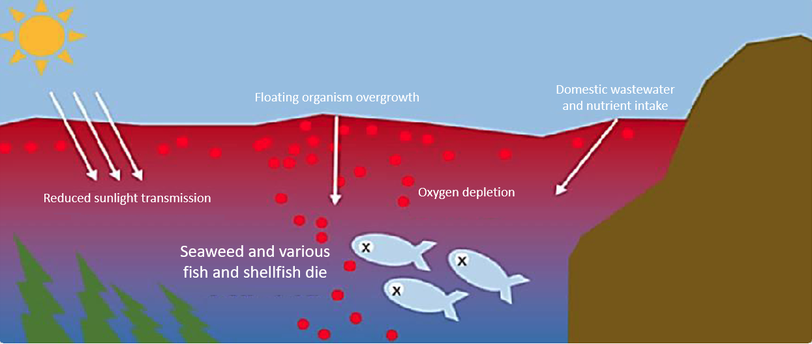

# 2021 Aquaculture Artificial Intelligence Idea Contest

[[Project Page]](https://dntai.vneasy.net/aquaculture_ai_contest_public/) 
[[Challenge Page]](http://sarc.jnu.ac.kr/contest/20211105/) 
[[Demo Program]](https://youtu.be/Vs9v_EXVCn0) 
[[Presentation]](https://www.youtube.com/watch?v=T529Nq_P3qc)

## Table of Contents
+ [Overview](#Overview)
+ [Team information](#team-information)
+ [Our research](#our-research)
+ [Setup project](#setup-project)
+ [How to run program](#how-to-run-program)
+ [Citation](#citation)

## Overview
+ **Subject**: Free Topic (Food-organism utilization throughout the AI-based aquaculture industry)
+ **Home page**: http://sarc.jnu.ac.kr/contest/20211105/
+ **Motivation**:
  + Stable mass feeding management of food organisms is importance of 'artificial seed culture' industry
  + Problems cause serious economic loss in the aquaculture artificial seed production industry
    + Reduction of aquaculture food organisms (plankton)
    + Difficulty in managing mass culture/feeding of food organisms
    + Mass mortality in the process of seed production
    + Decreased utilization of food organisms by field
    
    > A sharp decline in marine food organisms (plankton) due to global warming and marine environmental pollution
  + It is necessary to select and concentrate the government R&D AI data and technology to solve fundamental problems such as instability and low productivity in the aquaculture industry

## Team information: 
+ Team Name: **ADLER**
+ Affiliation: Chonnam National University, South Korea

## Our research
+ Please see in our project page at [[Project Page]](https://dntai.vneasy.net/aquaculture_ai_contest_public/)
## Setup Project
### Project Structure:
```
project
├── aquaculture
│   ├── app_v2
│   ├── apps
│   ├── assets
│   │   ├── cache
│   │   ├── data <-- Setup Data step
│   │   │   └── final_info.csv 
│   │   └── models
│   ├── exps
│   ├── utils
│   ├── cli_main.py
│   └── common.py
│   └── ...
├── data
│   ├── a2i_data <-- copy csv, 먹이생물 into here
│   │   ├── csv
│   │   │   ├── 10월01일
│   │   │   │   ├── 2-1-1-1-1-1001-0010000.csv (id-code.csv - sensors data)
│   │   │   │   └── 2-1-1-1-1-1001-0020000.csv
│   │   │   ├── 10월04일
│   │   │   └── ...
│   │   └── 먹이생물
│   │       ├── 10월01일
│   │       │   ├── 고성
│   │       │   │   ├── 2-1-1-2-2-1001-0120001.jpg (id-code.jpg - microsopy images)
│   │       │   │   ├── 2-1-1-2-2-1001-0120002.jpg
│   │       │   │   └── ...
│   │       │   ├── 일해
│   │       │   │   ├── 2-1-1-2-2-1001-0110001.jpg
│   │       │   │   ├── 2-1-1-2-2-1001-0110002.jpg
│   │       │   │   └── ...
│   │       ├── 10월04일
│   │       └── ...
│   ├── preprocessed <-- Setup Data step
│   │   ├── full_info.hdf5
│   │   ├── full_info.xlsx
│   │   ├── final_info.csv
│   │   ├── final_info.xlsx
│   │   └── final_info.hdf5
│   └── exps
└── images
```
### Setup Environments
+ Install Anaconda3 at https://www.anaconda.com/products/individual
+ Activate environment base
```bash
# Linux
conda activate base

# Window
activate base
```
  + Create environment a2i
```bash
conda create -n a2i python=3.8
```
  + Activate environment a2i
```bash
# Linux
conda activate a2i

# Window
activate a2i
```
  + Install requirements packages at environment base
```bash
pip install -r requirements.txt 
```

### Setup Data
+ Copy csv (sensors data), 먹이생물 (microscopy images) to folder **data**
+ Open console 
+ Go to project root 
```bash
# Linux
cd <project dir>

# Window
cd /d <project dir>
```
+ Activate Environment a2i
```bash
# Linux
conda activate a2i

# Window
activate a2i
```
+ Generate index files
```bash
python aquaculture/cli_main.py index
python aquaculture/cli_main.py detect-all 
```

## How to run program
### Run application
+ Go to project root
+ Activate Environment a2i
+ Type command
```bash
python aquaculture/cli_main.py app2 --app-type dash
```
+ Open Web browser and type url: http://localhost:8050

### Run console tasks
+ Go to project root
+ Activate Environment a2i
+ Type commands
  + Generate index files
```bash
python aquaculture/cli_main.py index
```
  + Detect number of cells in a microscopy image
```bash
python aquaculture/cli_main.py detect-one --id-code <id_code> (2-1-1-2-2-1001-0120126)
```
  + Detect number of cells in all microscopy image and save to index file
```bash
python aquaculture/cli_main.py detect-all
```
  + Data analysis belongs to places, grouping by day
```bash
python aquaculture/cli_main.py data-analysis
```
  + Training and Evaluating baseline algorithms
```bash
python aquaculture/cli_main.py baseline --config <config file>
```
  + Training and Evaluating tabnet algorithms
```bash
python aquaculture/cli_main.py tabnet --config <config file>
```
  + Prediction food-organism quality from sensor data
```bash
python aquaculture/cli_main.py prediction 
  --model <model_name> (sklearn, tabnet)
  --model-path <the path of model weights>
  --id-code <id_code>

or

python aquaculture/cli_main.py prediction 
  --model <model_name> (sklearn, tabnet)
  --model-path <the path of model weights>
  --temp <temparature> 
  --do <dissolved oxygen> 
  --ph <pH>
  --sal <salinity>
  --ntu <nephelometric turbidity unit> 
```

### View Experiment Demo 
+ Open html files in notebooks folder to view results of console tasks

## Citation
<a rel="license" href="http://creativecommons.org/licenses/by-nc-sa/4.0/"></a><br />This work is licensed under a <a rel="license" href="http://creativecommons.org/licenses/by-nc-sa/4.0/">Creative Commons Attribution-NonCommercial-ShareAlike 4.0 International License</a>.

All material is made available under [Creative Commons BY-NC-SA 4.0](https://creativecommons.org/licenses/by-nc-sa/4.0/legalcode) license by Adobe Inc. You can **use, redistribute, and adapt** the material for **non-commercial purposes**, as long as you give appropriate credit by **citing our paper** and **indicating any changes** that you've made.
